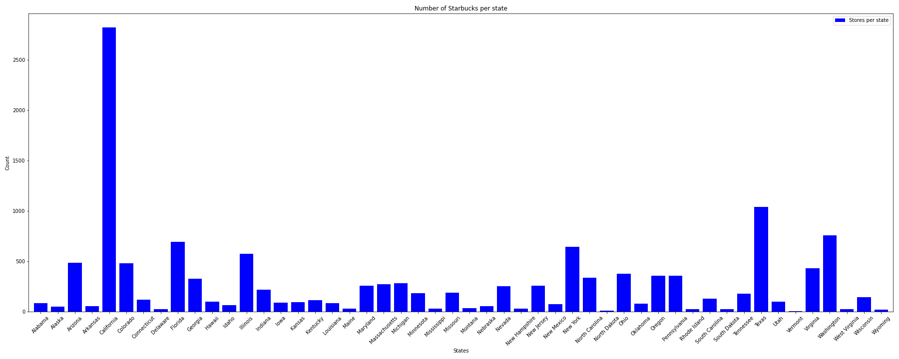

# Project_1_starbucks

|In this project our group selected starbucks dataset from kaggle to find a	Deeper dive and analysis of the Relationship between # of SB stores and avg income of the states 

Why Starbuck? Because we all need a sip of coffee to indulge in when things either go our way or not will always brighten your day. 

|To provide a taste of our findings the following image will give you an insight. 

